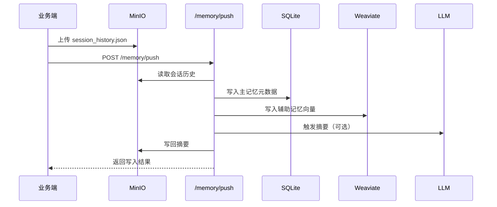
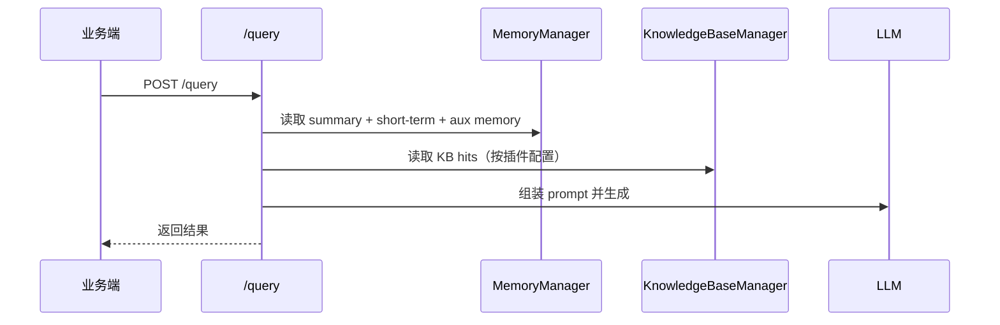

# 后端运行手册

本手册面向后端开发与联调，覆盖后端服务结构、核心流程、插件机制、数据流与排障要点。路径均以仓库根目录为准，不依赖项目名。

---

## 1. 服务结构与职责

后端入口：`backend/api/main.py`

- API 层：`backend/api/routers/*`
  - 通用：health、stores、app、kb、ingestion、memory
  - 业务：query、resume、jd
- 核心层：`backend/core/*`
  - 编排：`core/orchestrator/query_orchestrator.py`
  - 记忆：`core/memory/*`
  - KB：`core/kb/*`
  - Prompt：`core/prompt/*`
  - LLM/Embedding：`core/llm/*`、`core/embedding/*`
- 数据源：`backend/datasource/*`
  - SQLite / MinIO / Weaviate
- 插件：`backend/plugins/<app_id>/`

---

## 2. 基础启动与依赖

建议在已安装依赖的 Python 环境中启动后端（如 conda 或 venv）。服务启动后，可访问 `/health` 验证状态。

环境变量读取逻辑：`backend/settings/config.py`  
会自动向上查找 `.env` 并加载。

---

## 3. 身份模型（Identity）

核心身份由三元组构成：

```
wallet_id + app_id + session_id
```

它生成 `memory_key`，用于：

- 记忆隔离（SQLite + Weaviate）
- MinIO 路径构造
- 用户级检索过滤

---

## 4. 核心工作流

### 4.1 应用注册

- `POST /app/register`  
  用于将 app 进入 `active` 状态，供 `/query` 与 `/memory/push` 使用。

### 4.2 记忆写入

- 业务先把 `session_history.json` 写入 MinIO
- 调用 `POST /memory/push`
  - 写入 SQLite（主记忆元数据）
  - 写入 Weaviate（辅助记忆向量）
  - 达到阈值后生成摘要，写回 MinIO

### 4.3 KB 文档写入

接口：`POST /kb/{app_id}/{kb_key}/documents`

在 `user_upload` 类型下建议至少写入：

- `wallet_id`
- `allowed_apps`（当 KB 配置启用时）
- `source_url`
- `resume_id`
- `jd_id`
- `metadata_json`

### 4.4 查询编排

入口：`POST /query`  
流程由 `QueryOrchestrator` 负责，核心步骤：

1) 校验 app 状态  
2) 解析身份  
3) 读取短期/长期记忆  
4) 根据插件 KB 配置做向量检索  
5) 构造 Prompt 调用 LLM  

### 4.5 简历上传（推荐）

接口：`POST /resume/upload`

说明：
- 默认写入 app 下第一个 `user_upload` KB
- 返回 `resume_id`，供 `/query` 使用

### 4.6 JD 上传（推荐）

接口：`POST /{app_id}/jd/upload`

说明：
- 默认写入 app 下第一个 `user_upload` KB
- 返回 `jd_id`，供 `/query` 使用

---

## 5. 插件机制

插件目录：`backend/plugins/<app_id>/`

- `config.yaml`：声明 KB、memory、context、权重等
- `intents.yaml`：声明对外意图（exposed）
- `pipeline.py`：业务编排逻辑
- `prompts/`：提示词模板

插件通过 `PluginContext` 读取 MinIO 文件（`resume_url` / `jd_url`）。

---

## 6. 状态判定与健康检查

最小服务判定：

- `/health` 返回 `{"status":"ok"}`
- `/stores/health` 四项均为 `ok` / `configured`
- `/app/list` 显示 app 处于 `active`
- `/kb/list` 返回 KB 配置

---

## 7. 常见排障

### 7.1 Weaviate “already exists” 日志

这是幂等创建的常见提示。重启后端后应减少噪音，不影响功能。

### 7.2 user_upload 查询为空

排查：

- 文档是否写入 `wallet_id`
- `allowed_apps` 是否与当前 `app_id` 一致
- `/kb/{app}/{kb}/documents?wallet_id=xxx` 是否能查到

---

## 8. 时序图

### 8.1 记忆写入



### 8.2 查询编排


